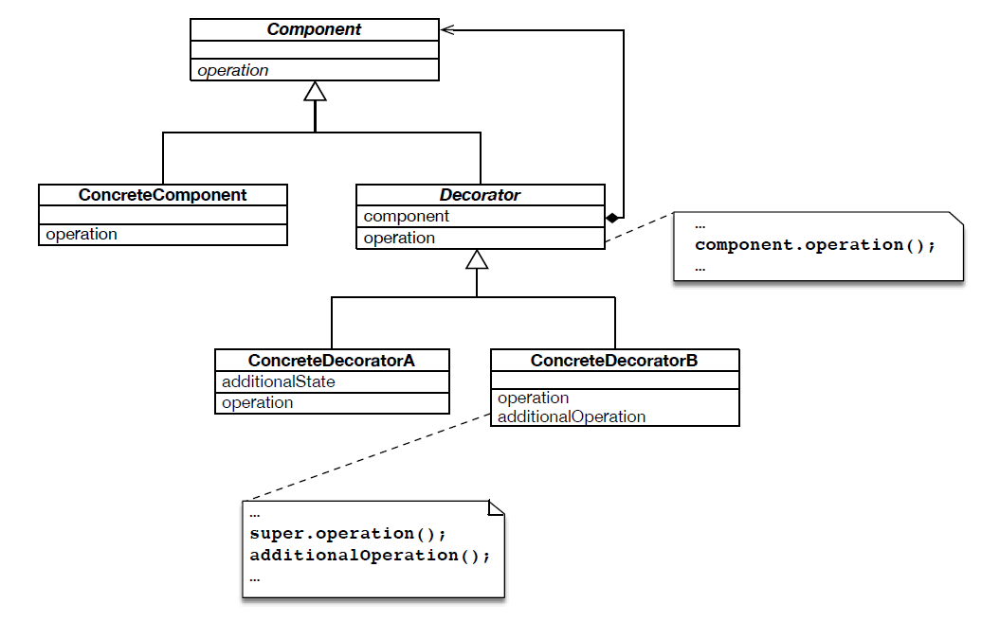

TODO

Structure

Component --> Beverage.java
ConcreteComponent --> DarkRoast.java, Decaf.java, Espresso.java, HouseBlend.java
Decorator --> CondimentDecorator.java
ConcreteDecorator --> Mocha.java, Soy.java, SteamedMilk.java, Whip.java